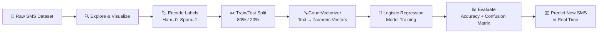

<div align="center">

# 📱 SMS Spam Detection using Machine Learning

### A Logistic Regression–based text classifier that flags unwanted SMS messages with **97.67% accuracy**

[](https://www.python.org/)
[](https://scikit-learn.org/)
[](https://pandas.pydata.org/)
[](https://jupyter.org/)
[](LICENSE)

[Overview](#-overview) •
[How It Works](#-how-it-works) •
[Results](#-results) •
[Installation](#-installation--setup) •
[Usage](#-usage) •
[Project Structure](#-project-structure) •
[Roadmap](#-roadmap)

</div>

---

## 📖 Overview

Spam messages are more than an annoyance — they're a common vector for phishing, fraud, and scams. This project builds an **end-to-end supervised machine learning pipeline** that automatically classifies SMS text messages as either:

- ✅ **Ham** — a normal, legitimate message
- 🚫 **Spam** — an unwanted or promotional message

The model is trained on the well-known **SMS Spam Collection Dataset** (5,572 real, labeled SMS messages) and uses **Bag-of-Words feature extraction (`CountVectorizer`)** combined with **Logistic Regression** to achieve strong, reliable performance — all in a single, readable Jupyter Notebook.

> 💡 This project was built as part of a hands-on ML bootcamp mini-project, covering the full ML workflow: data exploration → preprocessing → feature engineering → model training → evaluation → real-time inference.

---

## 🧠 How It Works



| Stage | Technique Used |
|---|---|
| Text Vectorization | `CountVectorizer` (with English stopword removal) |
| Classification Model | `LogisticRegression` (scikit-learn) |
| Train/Test Split | 80% train / 20% test, stratified |
| Evaluation | Accuracy Score + Confusion Matrix |

---

## 📊 Results

The model was evaluated on a held-out test set of **1,115 unseen messages**:

| Metric | Value |
|---|---|
| **Accuracy** | **97.67%** |
| Correctly Classified | 1,089 / 1,115 messages |
| False Positives (Ham → Spam) | 0 |
| False Negatives (Spam → Ham) | 26 |

**Confusion Matrix**

| | Predicted Ham | Predicted Spam |
|---|---|---|
| **Actual Ham** | 966 ✅ | 0 |
| **Actual Spam** | 26 | 123 ✅ |

🔑 **Key takeaway:** the model has a **zero false-positive rate** on this test split — it never misclassified a legitimate message as spam, which matters a lot in a real-world filter where blocking a genuine message is far more costly than letting an occasional spam message through.

---

## 📁 Dataset

**[SMS Spam Collection Dataset](https://www.kaggle.com/datasets/uciml/sms-spam-collection-dataset)** (originally from the UCI Machine Learning Repository)

| Property | Detail |
|---|---|
| Total messages | 5,572 |
| Ham messages | 4,825 (~86.6%) |
| Spam messages | 747 (~13.4%) |
| Columns | `Category` (ham/spam), `Message` (raw SMS text) |
| Format | CSV |

The dataset is included in this repo as [`spam.csv`](spam.csv).

---

## 🛠️ Tech Stack

- **Language:** Python 3
- **Data Handling:** Pandas, NumPy
- **Visualization:** Matplotlib
- **Machine Learning:** scikit-learn
  - `CountVectorizer` — text-to-numeric feature extraction
  - `LogisticRegression` — binary classification
  - `train_test_split`, `accuracy_score`, `confusion_matrix`, `ConfusionMatrixDisplay`
- **Environment:** Jupyter Notebook

---

## 📂 Project Structure

```
SMS-Spam-detection-bootcamp-project/
├── SMS Spam detection bootcamp project.ipynb   # Main notebook — full pipeline
├── spam.csv                                    # Dataset (5,572 labeled SMS messages)
├── LICENSE                                     # MIT License
└── README.md                                   # Project documentation
```

---

## ⚙️ Installation & Setup

1. **Clone the repository**
   ```bash
   git clone https://github.com/ashishraj-hub/SMS-Spam-detection-bootcamp-project.git
   cd SMS-Spam-detection-bootcamp-project
   ```

2. **Install dependencies**
   ```bash
   pip install pandas numpy matplotlib scikit-learn jupyter
   ```

3. **Launch the notebook**
   ```bash
   jupyter notebook "SMS Spam detection bootcamp project.ipynb"
   ```

4. **Run all cells** — the notebook will load the data, train the model, display evaluation metrics, and prompt you to test your own SMS message.

---

## 🚀 Usage

Once the model is trained, the final cell lets you test it interactively:

```python
message = input("Enter an SMS message: ")
message_vector = vectorizer.transform([message])
prediction = model.predict(message_vector)[0]

print("Prediction: SPAM" if prediction == 1 else "Prediction: HAM")
```

**Example:**
```
Enter an SMS message: Congratulations! You've won a free cruise, call now to claim your prize!
Prediction: SPAM
```

---

## 🗺️ Roadmap

Potential extensions to take this project further:

- [ ] Compare against Naive Bayes, SVM, and Random Forest classifiers
- [ ] Swap `CountVectorizer` for `TF-IDF` and benchmark the difference
- [ ] Add precision, recall, and F1-score alongside accuracy
- [ ] Deploy as an interactive web app using Streamlit or Flask
- [ ] Package the model with `pickle`/`joblib` for reuse without retraining

---

## 📄 License

This project is licensed under the **MIT License** — see the [LICENSE](LICENSE) file for details.

---

## 👤 Author

**Ashish Raj**
B.Tech CSE Student · AI/ML & Data Enthusiast

[](https://github.com/ashishraj-hub)

---

<div align="center">

⭐ If you found this project useful or interesting, consider giving it a star — it helps a lot!

</div>
